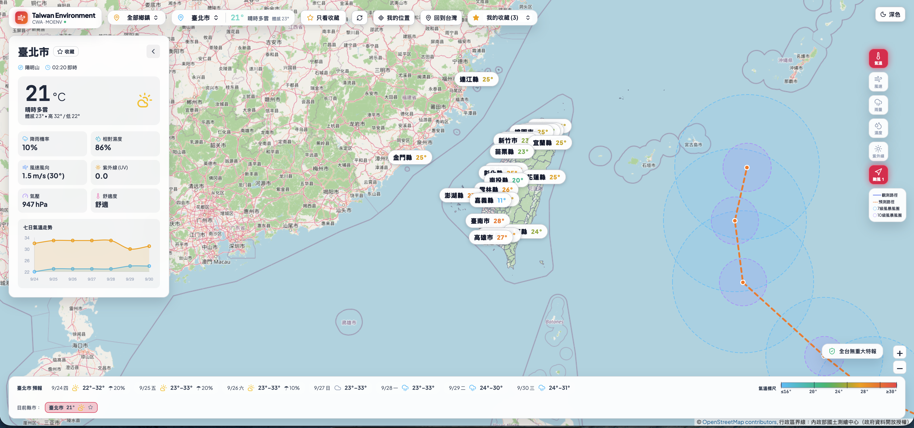

# Taiwan Environment Platform

台灣即時天氣與地圖平台，整合中央氣象署（CWA）觀測、預報與特報資料，並以 Leaflet 顯示縣市、鄉鎮及測站資訊。

- 線上前端：[frontend-delta-three-29.vercel.app](https://frontend-delta-three-29.vercel.app/)
- GitHub Repository：[marukomaru777/260923hw1-weather](https://github.com/marukomaru777/260923hw1-weather)



## 功能介紹

- **全台天氣地圖**：呈現縣市天氣與有觀測資料的測站數值。選取縣市或鄉鎮後地圖會聚焦至對應範圍；縣市視角放大至鄉鎮層級，便於查看測站分布。
- **天氣圖層**：可切換氣溫、風速、雨量、濕度與紫外線指數，地圖數值依圖層色階上色，並以有刻度的標尺呈現數值區間。
- **天氣詳細資料與預報**：選取地區可查看即時天氣觀測與七天天氣預報；地圖底部顯示目前縣市的預報資訊及溫度走勢。
- **天氣特報**：顯示中央氣象署發布的即時天氣特報。
- **颱風資訊**：整合颱風警報 CAP 與熱帶氣旋路徑資料；地圖可切換觀測路徑與預測路徑，並顯示 7 級風與 10 級風暴風圈。開啟颱風圖層不會改變預設的全台地圖範圍。
- **收藏地點**：可收藏縣市或鄉鎮，收藏儲存在瀏覽器 `localStorage`。支援全台與只看收藏兩種顯示模式；收藏下拉選單可聚焦單一收藏地點，不會改變天氣詳細資料或隱藏目前模式中的其他資料。縣市收藏會聚焦至該縣市的鄉鎮層級；地圖測站只會在個別鄉鎮已收藏時顯示收藏星號。
- **定位與地圖操作**：可授權瀏覽器定位並選取所在縣市，也可按「回到台灣」返回全台檢視；地圖支援縮放。
- **介面主題**：支援深色／淺色模式切換，深色模式同步切換深色底圖。
- **地圖資料**：使用 OpenStreetMap 底圖與專案內的鄉鎮界線 GeoJSON，不需要地圖 API key。全台視角顯示縣市標籤；放大後沿用底圖地名，避免重複遮住鄉鎮名稱。底圖提供者與界線資料來源會在地圖上標示。

## 技術說明

### 系統架構與資料流程

```text
┌──────────────────┐       HTTPS / JSON       ┌────────────────────┐
│ React + Leaflet   │ ────────────────────────> │ FastAPI             │
│ Vercel 靜態前端   │   VITE_API_BASE_URL      │ Vercel Python Func. │
└──────────────────┘                           └─────────┬──────────┘
          │                                               │
          ├─ GeoJSON 行政區界線                           ├─ CWA OpenData
          ├─ OpenStreetMap 瓦片                           ├─ TTL 記憶體快取
          └─ localStorage 收藏                           └─ SQLite 歷史資料
```

前端地圖資料透過 Fetch API 呼叫 FastAPI，使用 JSON 傳輸縣市天氣、七天天氣預報、測站觀測與特報。行政區界線由專案內的 `frontend/public/taiwan-townships.geojson` 提供；OpenStreetMap 提供底圖瓦片與地名，不需要地圖 API key。瀏覽器定位使用 Geolocation API，縣市／鄉鎮判斷在本機透過行政區 GeoJSON 點位比對完成。

### 技術選型

| 部分 | 技術 |
| --- | --- |
| 前端應用 | React 19、TypeScript、Vite 8；Vite 負責開發伺服器與靜態 bundle 建置。 |
| 地圖 / 視覺化 | Leaflet 顯示 OSM 瓦片與行政區 GeoJSON；Chart.js / `react-chartjs-2` 顯示七日溫度走勢。 |
| API | Python、FastAPI、Uvicorn、HTTPX；routers 按天氣、預報、測站、特報、颱風、收藏與歷史資料拆分。 |
| 儲存 | SQLite 本機保存觀測、預報與特報歷史；API 快取為程序內 TTL cache；前端收藏存於使用者瀏覽器 `localStorage`。 |
| 部署 | Vercel 以兩個獨立 Project 部署靜態前端與 Python API，透過環境變數連接。 |

### 地圖與資料呈現

- `WeatherLayer` 定義氣溫、風速、雨量、濕度與紫外線圖層；`frontend/src/types/map.ts` 集中管理各圖層數值範圍、色階與標尺漸層，確保圖例與測站標記共用同一套色彩映射。
- 全台模式保留各縣市讀值；收藏模式呈現所有收藏地區。單獨選擇收藏只移動地圖視角，不改變目前詳細資料，也不在該模式中隱藏其他資料。選取縣市時聚焦至該縣市的市中心位置（zoom 10.5）；選取鄉鎮時以鄉鎮 polygon bounds `fitBounds`，最高 zoom 12。縣市中心採用市區／縣治座標，避免以含偏遠地區或離島的行政區幾何中心造成視角偏移。
- 全台縮放層級顯示縣市天氣標籤；放大後使用底圖原生鄉鎮地名，避免重複覆蓋名稱，測站讀值仍以獨立 marker 顯示。
- 測站、預報、特報與颱風路徑由不同 API router 提供。颱風觀測路徑以藍線呈現，預測路徑以橘色虛線呈現；各定位點另繪製 7 級風（15 m/s）及 10 級風（25 m/s）暴風圈。沒有活動系統時不顯示路徑；颱風路徑位於台灣總覽範圍外時仍維持原有總覽縮放，不會自動把地圖移離台灣。前端請求失敗或逾時時會回退至 `frontend/src/services/fallbackData.ts` 的示範資料；因此確認即時資料應查看後端 API 回應與瀏覽器 Network，而不能只依 UI 是否有數值判斷。

## 資料來源

- CWA `O-A0003-001`：自動氣象站觀測。
- CWA `F-D0047` 縣市週預報資料集：依縣市使用對應資料集取得七天鄉鎮預報，再彙整成縣市每日最高／最低溫度。
- CWA `W-C0033-001`：天氣特報。
- CWA `W-C0034-001`：颱風 CAP 警報，併入特報面板。
- CWA `W-C0034-005`：熱帶氣旋觀測與預測路徑，透過 `/api/typhoon/tracks` 提供前端並在地圖上疊加顯示。
- OpenStreetMap：地圖底圖。
- `frontend/public/taiwan-townships.geojson`：縣市與鄉鎮界線。

## 本機執行

需要 Python 3.9+、Node.js 20.19+（或 22.12+）及 npm。

### 一鍵啟動

在專案根目錄執行：

```bash
./start.sh
```

前端網址為 <http://127.0.0.1:5173>，後端 API 文件為 <http://127.0.0.1:8000/docs>。按 `Ctrl+C` 停止兩個服務。

### 分別啟動

先設定後端：

```bash
cd backend
python3 -m venv venv
./venv/bin/pip install -r requirements.txt
cp .env.example .env
```

編輯 `backend/.env`，把 `CWA_API_KEY` 設為在 [CWA 開放資料平台](https://opendata.cwa.gov.tw/)申請的授權碼。不要把 `.env` 提交至 Git。

```bash
./venv/bin/uvicorn app.main:app --host 127.0.0.1 --port 8000
```

另開一個終端啟動前端：

```bash
cd frontend
npm install
npm run dev
```

開啟 <http://127.0.0.1:5173>。開發模式預設連線至 `http://127.0.0.1:8000`，通常不需設定前端環境變數。

若未設定有效的 CWA 金鑰或 API 無法連線，前端部分畫面會改顯示內建示範資料；請直接查詢後端 API 確認資料是否成功取得。

## Vercel 部署

此 repository 是 monorepo；前端靜態網站與 FastAPI 後端分別部署為兩個 Vercel Project，兩者連接同一個 GitHub repository，但使用不同 Root Directory。瀏覽器直接呼叫後端的 API origin，不經由前端 Vercel Project 轉送。

### 前後端請求路徑

```text
Browser
  ├─ GET https://<frontend-domain>/         → Vercel 靜態前端 (React/Vite)
  └─ GET https://<backend-domain>/api/...   → Vercel Python Function (FastAPI)
                                                └─ CWA OpenData
```

前端的 `frontend/src/services/api.ts` 讀取 `VITE_API_BASE_URL`，去除結尾的 `/` 後組成 `${VITE_API_BASE_URL}/api`。例如，若設為 `https://weather-api.example.vercel.app`，全台總覽的請求會送到 `https://weather-api.example.vercel.app/api/weather/overview`。正式環境未設定此變數時，前端會嘗試同網域 `/api`，因此 Backend 與 Frontend 分開部署時必須設定此值。

### Backend Project：FastAPI / Python Function

在 Vercel 建立第一個 Project，匯入 repository，設定：

| 設定 | 值 | 說明 |
| --- | --- | --- |
| Root Directory | `backend` | 從 `backend/` 尋找 Python 專案與相依套件。 |
| Framework Preset | Other，或讓 Vercel 自動偵測 Python | 本專案透過 Python Function 提供 FastAPI ASGI app。 |
| Build Command | 留空／使用自動偵測 | `backend/vercel.json` 目前僅宣告 schema，沒有自訂 build command。 |
| Output Directory | 留空 | Python API 不是靜態輸出目錄。 |

Vercel 以 `backend/index.py` 作為部署入口；此檔匯入 `app.main:app`。Python 套件由 `backend/requirements.txt` 安裝。`backend/app/main.py` 建立 FastAPI app、註冊天氣、預報、測站、特報、收藏與歷史資料 routers，並在啟動時初始化 SQLite schema。API 路由以 `/api/...` 提供，例如 `/api/health`、`/api/weather/overview`。

在 Backend Project 的 **Settings → Environment Variables** 設定：

| 變數 | 必要性 | 用途 |
| --- | --- | --- |
| `CWA_API_KEY` | 必要 | 後端向 CWA OpenData 發送授權請求。只能存於 Backend Project，不可使用 `VITE_` 前綴。 |
| `CACHE_TTL_SECONDS` | 選用，預設 `600` | 後端程序內記憶體快取的有效秒數。Serverless 執行個體各自快取，不保證跨執行個體共用。 |

至少將 `CWA_API_KEY` 指派到 Production；如需測試 Preview Deployment，也要將變數設定至 Preview scope。不要在 Vercel 設定 `PORT`；服務監聽埠由平台管理。儲存或更改變數後，重新部署 Backend，因為既有 deployment 不會自動取得新的環境變數。

Backend domain 建立後，記下它的 origin（協定與主機名稱，不加 `/api`），例如 `https://weather-api.example.vercel.app`。

### Frontend Project：React / Vite 靜態網站

在 Vercel 再建立一個 Project，仍連接同一 repository，設定：

| 設定 | 值 | 說明 |
| --- | --- | --- |
| Root Directory | `frontend` | 只使用前端專案、`package.json` 與 lockfile。 |
| Framework Preset | Vite | 產物為瀏覽器端 React 單頁應用程式。 |
| Install Command | `npm install`，或使用 Vercel 自動偵測 | 依 `frontend/package-lock.json` 安裝相依套件。 |
| Build Command | `npm run build` | 執行 `tsc -b` 型別建置，再由 Vite 輸出靜態資產。 |
| Output Directory | `dist` | 相對於 Frontend Root Directory，即 `frontend/dist`。 |

`frontend/vercel.json` 將未對應到靜態檔案的路徑 rewrite 至 `/index.html`，讓 React SPA 的前端路由可在重新整理或直接開啟路徑時載入。Vite 的 `base` 設為 `./`，靜態資產以相對路徑輸出。

在 Frontend Project 的 **Settings → Environment Variables** 設定：

| 變數 | 值 | 用途 |
| --- | --- | --- |
| `VITE_API_BASE_URL` | Backend origin，例如 `https://weather-api.example.vercel.app` | Vite 在 build 時注入前端 bundle，讓瀏覽器呼叫獨立部署的 API。不要加結尾 `/` 或 `/api`；前端會自行處理 `/api` 路徑。 |

`VITE_` 前綴代表變數會公開到使用者可下載的前端 JavaScript，適合放 API 網址等公開設定，**不可**放 `CWA_API_KEY` 或其他秘密。環境變數依 Production、Preview、Development scope 分開設定；修改 `VITE_API_BASE_URL` 後必須重新部署 Frontend，因為網址在 build 時已編入資產。

### 跨來源請求與 CORS

前後端位於不同 domain 時，瀏覽器會把 API 呼叫視為 cross-origin。FastAPI 在 `backend/app/main.py` 設有 `CORSMiddleware`；目前 `allow_origins` 為 `*`，前端 fetch 未使用 cookie 或 credentials。若將 API 限制為正式前端網域，需將 `allow_origins` 改為實際前端 origin，並為 Preview 網域另行設定允許來源；更新 Backend 後重新部署。

### Git 部署與 Preview

兩個 Vercel Projects 可連到相同 repository/branch，但各自只以其 Root Directory 建置。Production Branch 的新 commit 會分別觸發前後端部署；其他 branch 或 Pull Request 通常會產生 Preview Deployment。確認 Preview 前後端互通時，Frontend 的 Preview scope `VITE_API_BASE_URL` 必須指向可供預覽環境使用的 Backend domain，否則 Preview 頁面會連到 Production API 或使用 fallback 資料。部署後可在 Vercel Deployment 頁查看 build log、runtime log 與 domain alias。

### Serverless 執行限制

Vercel Python Function 是按請求執行的 Serverless runtime。程序記憶體中的 TTL cache 可能在 cold start 後清空，也不會在不同執行個體間同步。`backend/app/services/database_service.py` 偵測到 `VERCEL` 時將 SQLite 放在 `/tmp/environment.db`；`/tmp` 只供暫存，不是持久化儲存，資料可能隨執行個體回收而消失，也無法保證多個執行個體讀到同一份歷史。後端收藏 JSON 也不適合作為 Vercel 上的持久資料來源。地圖收藏由前端各使用者的 `localStorage` 保存，與後端收藏 API 分開。

### 部署後檢查

1. 開啟 `https://<backend-domain>/api/health`，確認 API Function 回應 `status: online`。這只代表應用程式有啟動，不代表 CWA 金鑰有效。
2. 開啟 `https://<backend-domain>/api/weather/overview`，確認回應的 `success` 與 `data`；若失敗，先檢查 Backend Runtime Logs 與 `CWA_API_KEY` scope。
3. 在瀏覽器開啟 Frontend，使用 Developer Tools → Network 確認請求送到 `https://<backend-domain>/api/...` 並回傳成功。若 Network 指向前端 domain `/api/...`，檢查 Frontend 的 `VITE_API_BASE_URL` 並重新部署。
4. 若 API 回應可用但網站顯示示範資料，檢查瀏覽器 Console／Network、CORS response headers 與 Frontend build 時採用的 API origin。前端 API 請求逾時或失敗時會使用內建 fallback 資料，因此 UI 顯示本身不能證明 Backend 已取得即時 CWA 資料。

## API

本機 API 根網址：`http://127.0.0.1:8000`。成功的資料端點通常回傳 JSON，資料欄位位於 `data`。

| 方法 | 路由 | 用途 |
| --- | --- | --- |
| `GET` | `/api/health` | 檢查 API 狀態、快取與 SQLite 資訊；不會驗證 CWA 是否成功回傳資料 |
| `GET` | `/api/weather/current?city=臺北市` | 指定縣市目前天氣與代表測站資料 |
| `GET` | `/api/weather/overview` | 全台縣市天氣總覽 |
| `GET` | `/api/forecast/7d?city=臺北市` | 指定縣市七天天氣預報；不帶 `city` 時查詢全部縣市 |
| `GET` | `/api/stations?county=臺北市` | 查詢測站，可用 `county` 篩選縣市 |
| `GET` | `/api/stations?county=臺北市&format=geojson` | 以 GeoJSON 回傳測站位置 |
| `GET` | `/api/alerts` | 天氣特報 |
| `GET` | `/api/typhoon/tracks` | 目前熱帶氣旋的觀測位置與預測路徑（CWA `W-C0034-005`） |
| `GET` | `/api/favorites` | 後端收藏清單 API（目前前端改用 `localStorage`） |
| `POST` | `/api/favorites` | 新增後端收藏，JSON body：`{"city":"臺北市"}` |
| `DELETE` | `/api/favorites/{city}` | 移除後端收藏 |
| `GET` | `/api/history/weather-observations?station_id=466920&limit=100` | 查詢本機 SQLite 測站觀測歷史 |

確認後端是否真的取得 CWA 資料，可直接查詢：

```bash
curl "http://127.0.0.1:8000/api/weather/current?city=%E8%87%BA%E5%8C%97%E5%B8%82"
```

預期 HTTP 成功且回傳 `success: true` 與非空的 `data`。`/api/health` 的 `online` 只代表後端有啟動，不保證外部 CWA API 請求成功。線上環境將網址換成 Backend Vercel origin。

## SQLite

本機第一次啟動後端時會建立 `backend/data/environment.db`。成功取得資料後，觀測、預報與特報會寫入 SQLite；可用 `DATABASE_PATH` 指定其他位置，預設快取時間為 600 秒，可用 `CACHE_TTL_SECONDS` 調整。資料庫檔案已排除於 Git。
